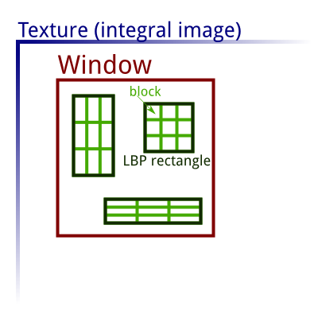
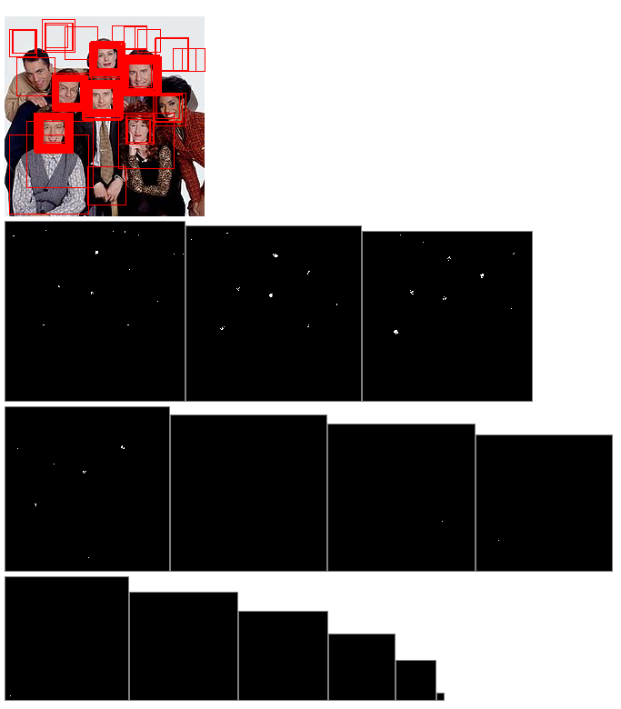
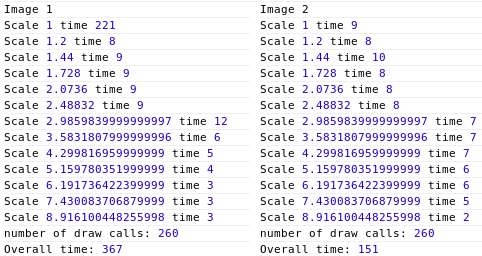

Coordinate Considerations
=========================

Working with the OpenGL ecosystem invariably requires an understanding of the
different coordinate systems used for the polygon vertices, textures and
screen. This becomes even more important when using OpenGL for computation, as
being off by one pixel (or a fraction of a pixel) can have much more serious
consequences than mere graphical glitches. If a texture is used as a lookup
table for arbitrary information, it is essential that the correct values are
indexed, to avoid giving, at best, completely incorrect results, or at worst
hard-to-detect bugs due to the limitations of floating point precision in the 0
to 1 range used to index textures.

Firstly we have the window (or screen) coordinates, which give the position in
the viewport, in other words the final image output. However, since the output
may be rendered to a texture, window coordinates don't have to be related to an
image actually displayed on the screen. They are similar to pixel positions,
however OpenGL itself does not have a concept of a pixel until rasterisation.
@Peers2002 gives a detailed mathematical treatment of OpenGL coordinates,
drawing from the OpenGL specification. In this way, the viewport can be treated
as a Cartesian plane whose origin and unit vectors are given by the
`gl.viewport(x,y,w,h)` command.  This sets the x,y offset of the origin, which is
at the bottom-left edge of the image, and determines the area of the scene
which should be rasterised, so in a graphics sense can be considered a sort of
cropping of the image. Two important points to note here are that the Y axis is
effectively flipped relative to the coordinate system usually used in graphics,
which has the origin at the top-left, and that integer coordinates will index
the bottom left corners of pixels, so to index the centre of a pixel requires
adding 0.5 to each dimension. For general purpose computation on a grid,
modifying the viewport can be used to change the output range of the
computation. For example, when doing face detection at different scales, the
"sliding window" of the detector will change size, meaning less pixel positions
need to be considered for larger windows, so the size of the output grid should
be smaller.


The vertex positions of polygons are specified by setting the `gl_Position`
variable in the vertex shader. This is a four dimensional `(x,y,z,w)` vector
where x,y,z are in Normalised Device Coordinates, a resolution-independent
coordinate system which varies from -1 to 1 in each dimension such that the
origin is at the centre. These then undergo perspective division by the fourth
`gl_Position.w` coordinate. For convenience we can use window coordinates when we
supply the vertices as an attribute, then compute the normalised coordinates in
the vertex shader by dividing by the image resolution. This will give a value
in the range [0,1], which can be changed to the range [-1,1] by multiplying by
2 then subtracting 1. For the purposes of computation on a 2D grid, the only
geometry we need is a rectangle aligned with the viewport, which we can get by
drawing two triangles. We do not want any perspective division, so z,w can be
set to 0,1. This effectively "passes through" the vertex coordinates, allowing
us to use them as if they were window coordinates.

The shader code to achieve this is: (where aPosition is the vertex position
attribute and uResolution gives the image resolution)

``` {.C}
vec2 normCoords = ((aPosition/uResolution) * 2.0) - 1.0;
gl_Position = vec4(normCoords, 0, 1);
```

Finally, we have to deal with the coordinates of texture maps, made up of texels
(the texture equivalent of a pixel) which are sampled using texture2D() in the
fragment shader. They have coordinates from 0,0 in the bottom left to 1,1 in the
top right. Textures may be sampled using different filtering methods in order to
interpolate between the discrete texels, the simplest being "NEAREST" which
simply uses the closest texel value, and "LINEAR" which interpolates linearly
based on the distance to surrounding texels. To sample at precisely the texel
centre, with no filtering, it is necessary to offset by half a texel, since the 
"zero" of a texel is at the bottom left corner.  So for the ith texel in a row
we would use X coordinate `(i + 0.5)/width` to offset then normalise to the \[0,1) range.


Initial Implementation
======================

The main strategy for the initial implementation of face detection in WebGL is
to offload the lookup operations on the integral image, the calculation of the
Local Binary Pattern values, and the subsequent window evaluation to the
fragment shader.  This allows the "sliding window" to be parallelised so that
we are evaluating multiple window positions at once. For each stage in the face
detection cascade we have to compute the Local Binary Pattern for various
rectangles within the window. Depending on which pattern we get for a
rectangle, it may either contribute a positive or a negative weighting towards
the window being a face. Summing the weights contributed by all the rectangles
and comparing against an overall threshold for the stage, we determine whether
the window should be rejected outright or subjected to further scrutiny in
later stages.  Computing each Local Binary Pattern rectangle requires 16
texture lookups, since we have to subdivide the rectangle into 3x3, giving 9
blocks, and compare the intensity of the centre block with the 8 surrounding
blocks. Using the integral image technique, finding the intensity of a block of
any area requires just four texture lookups, so for each rectangle we need to
sample 4x9 = 16 points.



The data on which Local Binary Patterns should be considered positive or
negative is accessed from the shader by using a grayscale texture as a lookup
table. There is one row for each stage in the cascade, so the height is the
number of stages, and for each LBP rectangle we have 256 possible patterns. A
black pixel is used to indicate a positive pattern, a white pixel a negative
pattern. The width of the texture is then 256 x the maximum number of
rectangles.  For the default cascade used, we have 20 stages and a maximum of
10 LBP rectangles, giving a $10\times2560$ texture. This differs from the more compact
representation used by OpenCV, which packs the data for one rectangle into 256
bits (8 32-bit ints) per rectangle but is necessary because the GL shader
language does not support the bitwise operations needed to extract the
individual bits (since numbers may in fact be implemented as floating point in
hardware), nor the range needed for 32-bit integers.

~~~~~ {.ditaa .no-separation}

 /------------------------------------------------------------------------\ 
 |cFC7                                                                    |
 |  Stage 1                                                               |
 |   o stageThreshold                                                     |
 |                                                                        |
 |    /------------\     /------------\     /------------\                |
 |    | Rectangle 1|     | Rectangle 2|     | Rectangle 3|                |
 |    +------------+     +------------+     +------------+                |
 |    | x          |     | x          |     | x          |                |
 |    | y          |     | y          |     | y          | ...            |
 |    | width      |     | width      |     | width      |                |
 |    | height     |     | height     |     | height     |                |
 |    | LBP vals   |     | LBP vals   |     | LBP vals   |                |
 |    \------+-----/     \------------/     \------------/                |
 |           |                                                            |
 |   Pattern ∈ LBP vals?                                                  |
 |     yes       no                                                       |
 |      |        |                                                        |
 |      |        |                                                        |
 |      v        v                                                        |
 |  positive   negative                                                   |
 |  weighting  weighting                                                  |
 |                                                                        |
 |                                                                        |
 \------------------------------------------------------------------------/
~~~~~

A shader program is compiled for each stage of the cascade, based on the same
shader source code but using compiler #defines to modify certain constants,
such as the number of rectangles.  This is because loop conditions in GLSL must
be based on constant expressions, so the number of rectangles to loop over
cannot be passed as variable. Each stage writes out a texture with a white
pixel for each window accepted, a black pixel otherwise. The texture from the
previous stage is used as an input to the next stage, to avoid computing
windows which have already been rejected.

On top of this loop over stages, we also need to consider different scales, to
be able to detect faces of different sizes in the image. This is done by
setting a scale factor, such as 1.2, which we successively multiply the window
size and rectangle offsets by. We run the detection for each scale, starting
from the base 24x24 pixel window size, until some maximum where the window
would be too big to fit in the image.

After detection is run on each scale, the accepted window texture is read back
to a JavaScript array using the WebGL `gl.readPixels` command, and used to draw
appropriately sized rectangles at the locations where faces have been found.



Achieving Higher Performance
============================

In order to test how fast this initial implementation is we can insert some
timer calls. We measure the time for each scale as well as the overall time for
the detection call (after the inital setup of shaders and textures), on an
image of dimensions 320x240 containing three faces of different scales.  This
gives the output shown below.


This gives an overall time of 375 milliseconds, obviously not good enough for
real time detection. Looking more closely, the majority of time seems to be
spent on the first scale, which takes 212 ms, whereas the other scales take
10ms or less.  Using the Chrome Javascript Profiler tool we can investigate
further by checking which functions are taking up the most time.


This shows that (besides the initial overhead of setting up the shaders) most
of the time is spent in the `gl.readPixels` function, responsible for
transferring image data from GPU memory back to JavaScript. An easy way to see
just how responsible this function is for the slowdown is to simply comment the
`readPixels` calls and associated code for drawing rectangles, which gives the following timings:


This shows a massive improvement, bringing the time down to 8ms, but obviously
our face detection is not very useful if we cannot actually get the locations
of the faces at the end!

The previous results were timed using a single image, running the detection
once after the page loads. In a real scenario we would want to be detecting
continually on each frame. This leads us to investigate the result of running
the detection on two different images, one after the other, without refreshing
the page. (In fact the same image, but flipped horizontally, so we would expect
similar face detection results, but avoid any clever caching by the
browser).



This gives the surprising result that, while the first run of the detection
takes a long time, the second is considerably shorter, with times between 2 and
10 ms for each scale. While we cannot determine the exact cause of this, it
seems that from a "cold start", readPixels has some overhead which is not
experienced on subsequent calls. So while readPixels is still the slowest
factor, once the detection gets going we need not worry about reads taking over
100ms. From here, the best strategy to improve overall time seems to be to
minimise the number of readPixels calls needed, ideally with just one at the
end of detection rather than intermediate calls for each scale.

While refactoring the code to "pingpong" by flipping between multiple
framebuffers, rather than the more expensive technique of using one framebuffer
and attaching different textures in turn (as recommended by @Tavares2011a at
37m20s), it was discovered that the slowdown on the first readPixels seemed to
disappear. However, after some work to narrow down the exact conditions which
would produce the slowdown, it was determined that this optimisation alone was
not responsible for the difference, but rather that it was determined by the
ordering of the calls to attach textures to the framebuffers, relative to the
code setting up the shaders. It turned out that, if at least one
`gl.framebufferTexture2D` call was before the shader setup, the initial
readPixels call took 12ms, whereas otherwise it took 560ms. The initial setup
which includes compiling the shaders takes around a second, so while the order
of calls does not change the initial setup time, it allows the "warm up" time
required before readPixels to effectively be hidden behind the time needed to
compile the shaders.


Bibliography
===========


